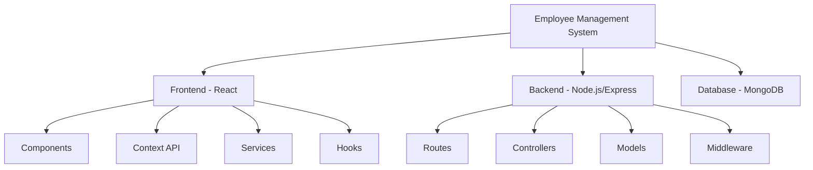

# Employee Management System

<div align="center">


A modern, full-stack employee management system built with the MERN stack.

[Features](#features) •
[Quick Start](#quick-start) •
[Documentation](#documentation) •
[Support](#support)

</div>

## 📋 Table of Contents

- [Overview](#overview)
- [Features](#features)
- [System Architecture](#system-architecture)
- [Quick Start](#quick-start)
- [Detailed Documentation](#detailed-documentation)
- [API Reference](#api-reference)
- [Development](#development)
- [Deployment](#deployment)
- [Contributing](#contributing)
- [License](#license)

## 🎯 Overview

The Employee Management System is a comprehensive solution for managing employee data, attendance, and organizational structure. It provides a user-friendly interface for HR personnel and administrators to manage employee information efficiently.

## ✨ Features

### 🔐 User Authentication & Authorization
- Secure JWT-based authentication
- Role-based access control
- Password recovery system
- Session management

### 👥 Employee Management
- Automated employee ID generation
- Comprehensive employee profiles
- Document management
- Emergency contact information

### 📊 Analytics & Reporting
- Department-wise statistics
- Employee status tracking
- Salary distribution analysis
- Custom report generation

### 🛠 Advanced Features
- Real-time search and filtering
- Bulk data import/export
- Audit logging
- Responsive design

## 🏗 System Architecture



## 🚀 Quick Start

### Prerequisites

- Node.js ≥ 14.0.0
- MongoDB ≥ 4.4
- npm or yarn

### Installation Steps

1. **Clone the repository**
```bash
git clone <repository-url>
cd employee-management-system
```

2. **Set up the backend**
```bash
cd backend
npm install
cp .env.example .env  # Configure your environment variables
npm run dev
```

3. **Set up the frontend**
```bash
cd frontend
npm install
npm start
```

## 📚 Detailed Documentation

### Directory Structure
```
employee-management-system/
├── backend/
│   ├── config/          # Configuration files
│   ├── controllers/     # Request handlers
│   ├── middleware/      # Custom middleware
│   ├── models/         # Database models
│   ├── routes/         # API routes
│   ├── utils/          # Utility functions
│   └── server.js       # Server entry point
├── frontend/
│   ├── public/         # Static files
│   └── src/
│       ├── components/ # React components
│       ├── context/    # Context providers
│       ├── hooks/      # Custom hooks
│       ├── pages/      # Page components
│       ├── services/   # API services
│       └── styles/     # Global styles
└── docs/              # Documentation
```

### Key Technologies

#### Backend
- **Express.js**: Web framework
- **Mongoose**: MongoDB ODM
- **JWT**: Authentication
- **Multer**: File uploads
- **Winston**: Logging

#### Frontend
- **React**: UI library
- **React Router**: Navigation
- **React Hook Form**: Forms
- **Styled Components**: Styling
- **Axios**: HTTP client

## 🔗 API Reference

See [API_DOCUMENTATION.md](./API_DOCUMENTATION.md) for detailed API documentation.

## 💻 Development

### Running Tests
```bash
# Backend tests
cd backend
npm test

# Frontend tests
cd frontend
npm test
```

### Code Style
- ESLint for code linting
- Prettier for code formatting
- Husky for pre-commit hooks

## 🌐 Deployment

### Backend Deployment
1. Set up environment variables
2. Configure MongoDB connection
3. Set up Node.js environment
4. Deploy using PM2 or similar

### Frontend Deployment
1. Build the React application
2. Configure environment variables
3. Deploy to hosting service

## 🤝 Contributing

1. Fork the repository
2. Create your feature branch
3. Commit your changes
4. Push to the branch
5. Open a Pull Request

See [CONTRIBUTING.md](./CONTRIBUTING.md) for detailed guidelines.

## 📄 License

This project is licensed under the MIT License - see the [LICENSE](./LICENSE) file for details.

## 🙏 Acknowledgments

- MongoDB for the database
- Express.js community
- React.js team
- Node.js community
- All contributors

## 📞 Support

For support, email support@example.com or join our Slack channel. 